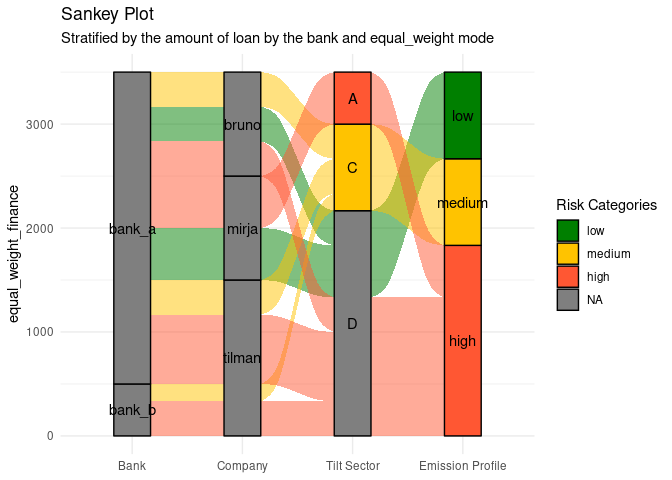
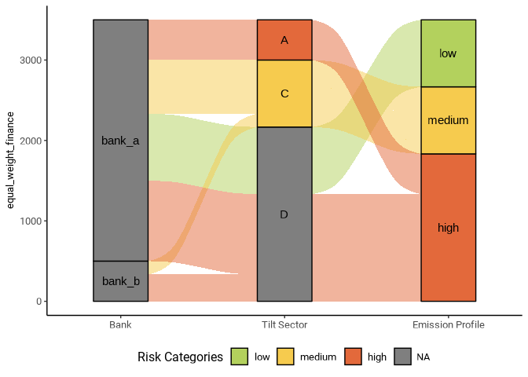
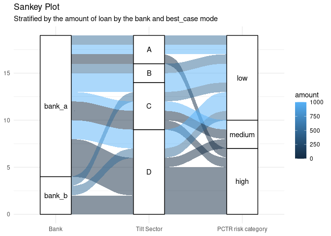
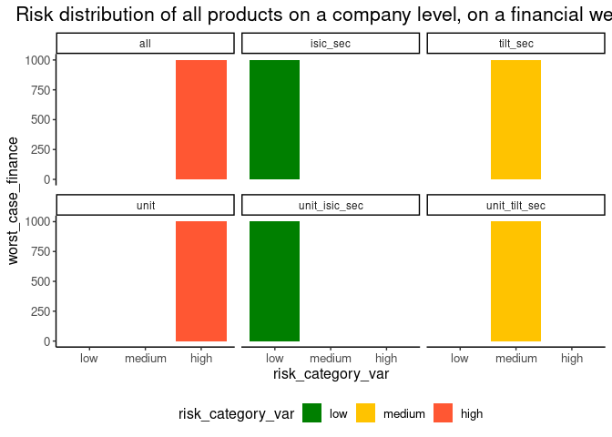
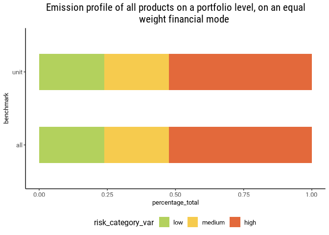
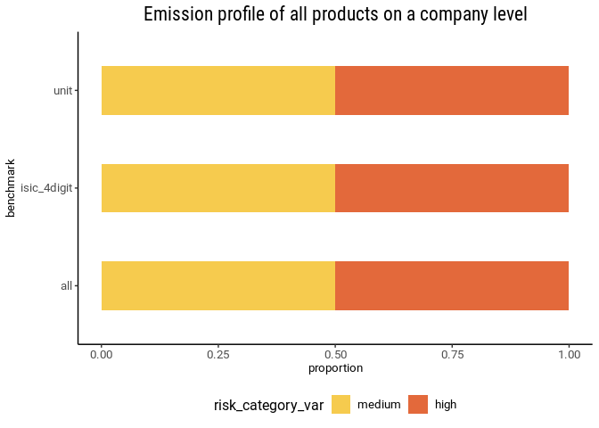
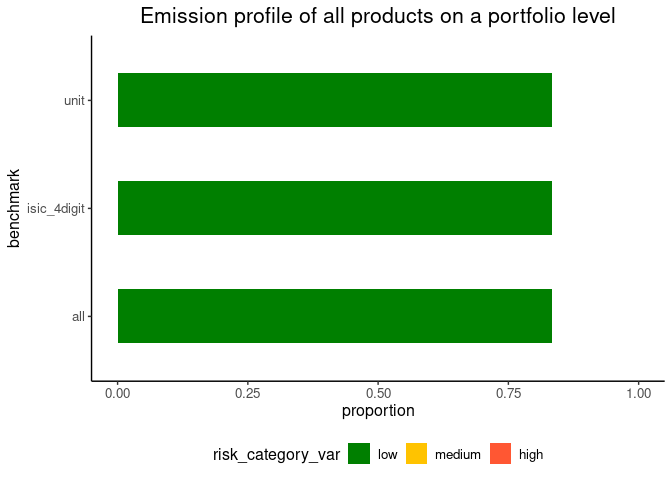

<!-- README.md is generated from README.Rmd. Please edit that file -->

# tiltPlot

<!-- badges: start -->

[](https://lifecycle.r-lib.org/articles/stages.html#experimental)
[](https://github.com/2DegreesInvesting/tiltPlot/actions/workflows/R-CMD-check.yaml)
[](https://app.codecov.io/gh/2DegreesInvesting/tiltPlot?branch=main)
<!-- badges: end -->

The goal of tiltPlot is to provide plots for the TILT project.

``` r
library(ggplot2)
library(dplyr)
#> 
#> Attaching package: 'dplyr'
#> The following objects are masked from 'package:stats':
#> 
#>     filter, lag
#> The following objects are masked from 'package:base':
#> 
#>     intersect, setdiff, setequal, union
library(tiltPlot)
```

### 1. Sankey Plot with financial data

``` r
financial
#> # A tibble: 114 × 13
#>    kg_id  amount_total company_name  wz    amount_of_distinct_products
#>    <chr>         <int> <chr>         <chr>                       <int>
#>  1 bank_a         1000 peter peasant A                               1
#>  2 bank_a         1000 peter peasant A                               1
#>  3 bank_a         1000 peter peasant A                               1
#>  4 bank_a         1000 peter peasant A                               1
#>  5 bank_a         1000 peter peasant A                               1
#>  6 bank_a         1000 peter peasant A                               1
#>  7 bank_a         1000 peter         B                               2
#>  8 bank_a         1000 peter         B                               2
#>  9 bank_a         1000 peter         B                               2
#> 10 bank_a         1000 peter         B                               2
#> # ℹ 104 more rows
#> # ℹ 8 more variables: xctr_risk_category <chr>, benchmark <chr>,
#> #   product_name <chr>, tilt_sector <chr>, equal_weight_finance <dbl>,
#> #   worst_case_finance <int>, best_case_finance <int>, main_activity <int>
```

Here is the default Sankey Plot. By default the function plots with
companies and uses an “equal_weight” mode.

``` r
fin <- financial
plot_sankey(fin)
```



You can also choose to have the plot without the company node.

``` r
plot_sankey(fin, with_company = FALSE)
```



Finally, the user can choose different modes to plot the Sankey plot
with financial data available.

``` r
plot_sankey(fin, with_company = FALSE, mode = "best_case")
```



### 2. XCTR plots with financial data

``` r
financial
#> # A tibble: 114 × 13
#>    kg_id  amount_total company_name  wz    amount_of_distinct_products
#>    <chr>         <int> <chr>         <chr>                       <int>
#>  1 bank_a         1000 peter peasant A                               1
#>  2 bank_a         1000 peter peasant A                               1
#>  3 bank_a         1000 peter peasant A                               1
#>  4 bank_a         1000 peter peasant A                               1
#>  5 bank_a         1000 peter peasant A                               1
#>  6 bank_a         1000 peter peasant A                               1
#>  7 bank_a         1000 peter         B                               2
#>  8 bank_a         1000 peter         B                               2
#>  9 bank_a         1000 peter         B                               2
#> 10 bank_a         1000 peter         B                               2
#> # ℹ 104 more rows
#> # ℹ 8 more variables: xctr_risk_category <chr>, benchmark <chr>,
#> #   product_name <chr>, tilt_sector <chr>, equal_weight_finance <dbl>,
#> #   worst_case_finance <int>, best_case_finance <int>, main_activity <int>
```

On a company level:

``` r
fin <- financial

plot_xctr_financial(fin, "peter", mode = "worst_case") +
  labs(title = "Risk distribution of all products on a company level, on a financial weight")
```



On a portfolio level:

``` r
plot_xctr_financial(fin, mode = "worst_case") +
  labs(title = "Risk distribution of all products on a portfolio level, on a financial weight")
```



### 3. XCTR plots without financial data

``` r
without_financial
#> # A tibble: 58 × 5
#>    company_name  xctr_risk_category benchmark     product_name tilt_sector
#>    <chr>         <chr>              <chr>         <chr>        <chr>      
#>  1 peter peasant high               all           car          D          
#>  2 peter peasant high               unit          car          D          
#>  3 peter peasant medium             tilt_sec      car          D          
#>  4 peter peasant medium             unit_tilt_sec car          D          
#>  5 peter peasant low                isic_sec      car          D          
#>  6 peter peasant low                unit_isic_sec car          D          
#>  7 peter         high               all           banana       A          
#>  8 peter         high               unit          banana       A          
#>  9 peter         medium             tilt_sec      banana       A          
#> 10 peter         medium             unit_tilt_sec banana       A          
#> # ℹ 48 more rows
```

To plot on a company level:

``` r
no_fin <- without_financial

no_fin |>
  filter(company_name == "peter") |>
  plot_xctr() +
  labs(title = "Risk distribution of all products on a company level")
```



On a portfolio level :

``` r
plot_xctr(no_fin) +
  labs(title = "Risk distribution of all products on a portfolio level")
```


