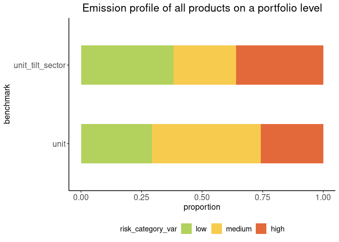

<!-- README.md is generated from README.Rmd. Please edit that file -->

# tiltPlot

<!-- badges: start -->

[](https://lifecycle.r-lib.org/articles/stages.html#experimental)
[](https://github.com/2DegreesInvesting/tiltPlot/actions/workflows/R-CMD-check.yaml)
[](https://app.codecov.io/gh/2DegreesInvesting/tiltPlot?branch=main)
<!-- badges: end -->

The goal of tiltPlot is to provide plots for the TILT project.

## Installation

You can install the development version of tiltPlot from GitHub with:

``` r
# install.packages("pak")
pak::pak("2DegreesInvesting/tiltPlot")
```

## Example

``` r
library(ggplot2)
library(dplyr, warn.conflicts = FALSE)
library(tiltPlot)
```

### 1. Sankey Plot with financial data

``` r
financial
#> # A tibble: 264 × 23
#>    bank_id amount_total company_name postcode benchmark ep_product
#>    <chr>          <int> <chr>           <int> <chr>     <chr>     
#>  1 bank_a          1000 tilman          12043 all       car       
#>  2 bank_a          1000 tilman          12043 all       tractor   
#>  3 bank_a          1000 tilman          12043 all       steel     
#>  4 bank_a          1000 tilman          12043 all       car       
#>  5 bank_a          1000 tilman          12043 all       tractor   
#>  6 bank_a          1000 tilman          12043 all       steel     
#>  7 bank_a          1000 tilman          12043 all       car       
#>  8 bank_a          1000 tilman          12043 all       tractor   
#>  9 bank_a          1000 tilman          12043 all       steel     
#> 10 bank_a          1000 tilman          12043 all       car       
#> # ℹ 254 more rows
#> # ℹ 17 more variables: co2_footprint_product <dbl>, tilt_sector <chr>,
#> #   tilt_subsector <chr>, isic_4digit <int>, isic_4digit_name <chr>,
#> #   amount_of_distinct_products <int>, equal_weight_finance <dbl>,
#> #   worst_case_finance <int>, best_case_finance <int>, emission_profile <chr>,
#> #   profile_ranking <dbl>, sector_profile <chr>, scenario <chr>, year <int>,
#> #   reduction_targets <dbl>, transition_risk_score <dbl>, …
```

``` r
fin <- financial
benchmark <- "tilt_sector"
mode <- "equal_weight"
plot_sankey(fin, with_company = TRUE, benchmark = "tilt_sector", mode = "equal_weight") +
  ggtitle(
    "Sankey Plot",
    paste("Stratified by the amount of loan by the bank, with the", mode, "mode", "and benchmark", benchmark)
  )
#> Registering font with R using pdfFont(): Roboto
#> Registering font with R using pdfFont(): Roboto Black
#> Registering font with R using pdfFont(): Roboto Condensed
#> Registering font with R using pdfFont(): Roboto Condensed Light
#> Registering font with R using pdfFont(): Roboto Condensed Medium
#> Registering font with R using pdfFont(): Roboto Light
#> Registering font with R using pdfFont(): Roboto Medium
#> Registering font with R using pdfFont(): Roboto Thin
#> Registering font with R using postscriptFont(): Roboto
#> Registering font with R using postscriptFont(): Roboto Black
#> Registering font with R using postscriptFont(): Roboto Condensed
#> Registering font with R using postscriptFont(): Roboto Condensed Light
#> Registering font with R using postscriptFont(): Roboto Condensed Medium
#> Registering font with R using postscriptFont(): Roboto Light
#> Registering font with R using postscriptFont(): Roboto Medium
#> Registering font with R using postscriptFont(): Roboto Thin
```


You can also choose to have the plot without the company node.

``` r
plot_sankey(fin, with_company = FALSE, benchmark = "tilt_sector", mode = "equal_weight")
#> Roboto already registered with pdfFont().
#> Roboto Black already registered with pdfFont().
#> Roboto Condensed already registered with pdfFont().
#> Roboto Condensed Light already registered with pdfFont().
#> Roboto Condensed Medium already registered with pdfFont().
#> Roboto Light already registered with pdfFont().
#> Roboto Medium already registered with pdfFont().
#> Roboto Thin already registered with pdfFont().
#> Roboto already registered with postscriptFont().
#> Roboto Black already registered with postscriptFont().
#> Roboto Condensed already registered with postscriptFont().
#> Roboto Condensed Light already registered with postscriptFont().
#> Roboto Condensed Medium already registered with postscriptFont().
#> Roboto Light already registered with postscriptFont().
#> Roboto Medium already registered with postscriptFont().
#> Roboto Thin already registered with postscriptFont().
```


Finally, the user can choose different modes to plot the Sankey plot
with financial data available.

``` r
plot_sankey(fin, with_company = FALSE, benchmark = "tilt_sector", mode = "best_case")
#> Roboto already registered with pdfFont().
#> Roboto Black already registered with pdfFont().
#> Roboto Condensed already registered with pdfFont().
#> Roboto Condensed Light already registered with pdfFont().
#> Roboto Condensed Medium already registered with pdfFont().
#> Roboto Light already registered with pdfFont().
#> Roboto Medium already registered with pdfFont().
#> Roboto Thin already registered with pdfFont().
#> Roboto already registered with postscriptFont().
#> Roboto Black already registered with postscriptFont().
#> Roboto Condensed already registered with postscriptFont().
#> Roboto Condensed Light already registered with postscriptFont().
#> Roboto Condensed Medium already registered with postscriptFont().
#> Roboto Light already registered with postscriptFont().
#> Roboto Medium already registered with postscriptFont().
#> Roboto Thin already registered with postscriptFont().
```


### 2. Emission profile plots with financial data

``` r
financial
#> # A tibble: 264 × 23
#>    bank_id amount_total company_name postcode benchmark ep_product
#>    <chr>          <int> <chr>           <int> <chr>     <chr>     
#>  1 bank_a          1000 tilman          12043 all       car       
#>  2 bank_a          1000 tilman          12043 all       tractor   
#>  3 bank_a          1000 tilman          12043 all       steel     
#>  4 bank_a          1000 tilman          12043 all       car       
#>  5 bank_a          1000 tilman          12043 all       tractor   
#>  6 bank_a          1000 tilman          12043 all       steel     
#>  7 bank_a          1000 tilman          12043 all       car       
#>  8 bank_a          1000 tilman          12043 all       tractor   
#>  9 bank_a          1000 tilman          12043 all       steel     
#> 10 bank_a          1000 tilman          12043 all       car       
#> # ℹ 254 more rows
#> # ℹ 17 more variables: co2_footprint_product <dbl>, tilt_sector <chr>,
#> #   tilt_subsector <chr>, isic_4digit <int>, isic_4digit_name <chr>,
#> #   amount_of_distinct_products <int>, equal_weight_finance <dbl>,
#> #   worst_case_finance <int>, best_case_finance <int>, emission_profile <chr>,
#> #   profile_ranking <dbl>, sector_profile <chr>, scenario <chr>, year <int>,
#> #   reduction_targets <dbl>, transition_risk_score <dbl>, …
```

On a company level:

``` r
fin <- financial

benchmarks <- c("all", "unit")

fin |>
  filter(company_name == "tilman") |>
  bar_plot_emission_profile_financial(benchmarks, mode = "equal_weight") +
  labs(title = "Emission profile of all products on a company level, on an equal
       weight financial mode")
#> Roboto already registered with pdfFont().
#> Roboto Black already registered with pdfFont().
#> Roboto Condensed already registered with pdfFont().
#> Roboto Condensed Light already registered with pdfFont().
#> Roboto Condensed Medium already registered with pdfFont().
#> Roboto Light already registered with pdfFont().
#> Roboto Medium already registered with pdfFont().
#> Roboto Thin already registered with pdfFont().
#> Roboto already registered with postscriptFont().
#> Roboto Black already registered with postscriptFont().
#> Roboto Condensed already registered with postscriptFont().
#> Roboto Condensed Light already registered with postscriptFont().
#> Roboto Condensed Medium already registered with postscriptFont().
#> Roboto Light already registered with postscriptFont().
#> Roboto Medium already registered with postscriptFont().
#> Roboto Thin already registered with postscriptFont().
```


On a portfolio level:

``` r
bar_plot_emission_profile_financial(fin, benchmarks, mode = "equal_weight") +
  labs(title = "Emission profile of all products on a portfolio level, on an equal
       weight financial mode")
#> Roboto already registered with pdfFont().
#> Roboto Black already registered with pdfFont().
#> Roboto Condensed already registered with pdfFont().
#> Roboto Condensed Light already registered with pdfFont().
#> Roboto Condensed Medium already registered with pdfFont().
#> Roboto Light already registered with pdfFont().
#> Roboto Medium already registered with pdfFont().
#> Roboto Thin already registered with pdfFont().
#> Roboto already registered with postscriptFont().
#> Roboto Black already registered with postscriptFont().
#> Roboto Condensed already registered with postscriptFont().
#> Roboto Condensed Light already registered with postscriptFont().
#> Roboto Condensed Medium already registered with postscriptFont().
#> Roboto Light already registered with postscriptFont().
#> Roboto Medium already registered with postscriptFont().
#> Roboto Thin already registered with postscriptFont().
```


### 3. Emission profile plots without financial data

``` r
without_financial
#> # A tibble: 114 × 12
#>    company_name postcode emission_profile benchmark ep_product tilt_sector
#>    <chr>           <int> <chr>            <chr>     <chr>      <chr>      
#>  1 bruno           27568 high             all       car        D          
#>  2 bruno           27568 high             all       steel      C          
#>  3 bruno           27568 medium           all       wheat      B          
#>  4 mauro           39221 high             all       steel      C          
#>  5 mauro           39221 high             all       machine    C          
#>  6 mirja           34117 high             all       tractor    D          
#>  7 mirja           34117 high             all       cattle     A          
#>  8 pasant          80337 high             all       tractor    D          
#>  9 pasant          80337 low              all       apple      A          
#> 10 peter           88131 high             all       banana     A          
#> # ℹ 104 more rows
#> # ℹ 6 more variables: tilt_subsector <chr>, isic_4digit <chr>,
#> #   isic_4digit_name <chr>, equal_weight <dbl>, worst_case <dbl>,
#> #   best_case <dbl>
```

Plot on a company level. The user can choose any number of benchmark to
be plotted.

``` r
no_fin <- without_financial

benchmarks <- c("all", "isic_4digit", "unit")

no_fin |>
  filter(company_name == "peter") |>
  bar_plot_emission_profile(benchmarks) +
  labs(title = "Emission profile of all products on a company level")
#> Roboto already registered with pdfFont().
#> Roboto Black already registered with pdfFont().
#> Roboto Condensed already registered with pdfFont().
#> Roboto Condensed Light already registered with pdfFont().
#> Roboto Condensed Medium already registered with pdfFont().
#> Roboto Light already registered with pdfFont().
#> Roboto Medium already registered with pdfFont().
#> Roboto Thin already registered with pdfFont().
#> Roboto already registered with postscriptFont().
#> Roboto Black already registered with postscriptFont().
#> Roboto Condensed already registered with postscriptFont().
#> Roboto Condensed Light already registered with postscriptFont().
#> Roboto Condensed Medium already registered with postscriptFont().
#> Roboto Light already registered with postscriptFont().
#> Roboto Medium already registered with postscriptFont().
#> Roboto Thin already registered with postscriptFont().
```


Plot on a portfolio level.

``` r
bar_plot_emission_profile(no_fin, benchmarks) +
  labs(title = "Emission profile of all products on a portfolio level")
#> Roboto already registered with pdfFont().
#> Roboto Black already registered with pdfFont().
#> Roboto Condensed already registered with pdfFont().
#> Roboto Condensed Light already registered with pdfFont().
#> Roboto Condensed Medium already registered with pdfFont().
#> Roboto Light already registered with pdfFont().
#> Roboto Medium already registered with pdfFont().
#> Roboto Thin already registered with pdfFont().
#> Roboto already registered with postscriptFont().
#> Roboto Black already registered with postscriptFont().
#> Roboto Condensed already registered with postscriptFont().
#> Roboto Condensed Light already registered with postscriptFont().
#> Roboto Condensed Medium already registered with postscriptFont().
#> Roboto Light already registered with postscriptFont().
#> Roboto Medium already registered with postscriptFont().
#> Roboto Thin already registered with postscriptFont().
```



### 4. Scatter plot of the emission profiles and transition risk scores, with financial data

``` r
fin <- financial
scenario <- "WEO"
year <- 2030
benchmarks <- c("all", "unit")
mode <- "best_case"

scatter_plot_financial(fin,
  benchmarks = benchmarks,
  mode = mode,
  scenario = scenario,
  year = year
)
#> Roboto already registered with pdfFont().
#> Roboto Black already registered with pdfFont().
#> Roboto Condensed already registered with pdfFont().
#> Roboto Condensed Light already registered with pdfFont().
#> Roboto Condensed Medium already registered with pdfFont().
#> Roboto Light already registered with pdfFont().
#> Roboto Medium already registered with pdfFont().
#> Roboto Thin already registered with pdfFont().
#> Roboto already registered with postscriptFont().
#> Roboto Black already registered with postscriptFont().
#> Roboto Condensed already registered with postscriptFont().
#> Roboto Condensed Light already registered with postscriptFont().
#> Roboto Condensed Medium already registered with postscriptFont().
#> Roboto Light already registered with postscriptFont().
#> Roboto Medium already registered with postscriptFont().
#> Roboto Thin already registered with postscriptFont().
#> Roboto already registered with pdfFont().
#> Roboto Black already registered with pdfFont().
#> Roboto Condensed already registered with pdfFont().
#> Roboto Condensed Light already registered with pdfFont().
#> Roboto Condensed Medium already registered with pdfFont().
#> Roboto Light already registered with pdfFont().
#> Roboto Medium already registered with pdfFont().
#> Roboto Thin already registered with pdfFont().
#> Roboto already registered with postscriptFont().
#> Roboto Black already registered with postscriptFont().
#> Roboto Condensed already registered with postscriptFont().
#> Roboto Condensed Light already registered with postscriptFont().
#> Roboto Condensed Medium already registered with postscriptFont().
#> Roboto Light already registered with postscriptFont().
#> Roboto Medium already registered with postscriptFont().
#> Roboto Thin already registered with postscriptFont().
```


### 5. Create a German map with risk categories color gradient, without financial

Different modes can be chosen: “equal_weight”, “worst_case” and
“best_case”. If nothing is chosen, equal_weight the default mode.

``` r
no_fin <- without_financial

map_region_risk(no_fin, "DE", benchmark = "tilt_sector", mode = "best_case") +
  labs(title = "German map of high, medium and low proportions of the companies
  that are found in one region.
  © EuroGeographics for the administrative boundaries ")
#> Extracting data using giscoR package, please report issues on https://github.com/rOpenGov/giscoR/issues
#> Roboto already registered with pdfFont().
#> Roboto Black already registered with pdfFont().
#> Roboto Condensed already registered with pdfFont().
#> Roboto Condensed Light already registered with pdfFont().
#> Roboto Condensed Medium already registered with pdfFont().
#> Roboto Light already registered with pdfFont().
#> Roboto Medium already registered with pdfFont().
#> Roboto Thin already registered with pdfFont().
#> Roboto already registered with postscriptFont().
#> Roboto Black already registered with postscriptFont().
#> Roboto Condensed already registered with postscriptFont().
#> Roboto Condensed Light already registered with postscriptFont().
#> Roboto Condensed Medium already registered with postscriptFont().
#> Roboto Light already registered with postscriptFont().
#> Roboto Medium already registered with postscriptFont().
#> Roboto Thin already registered with postscriptFont().
```


