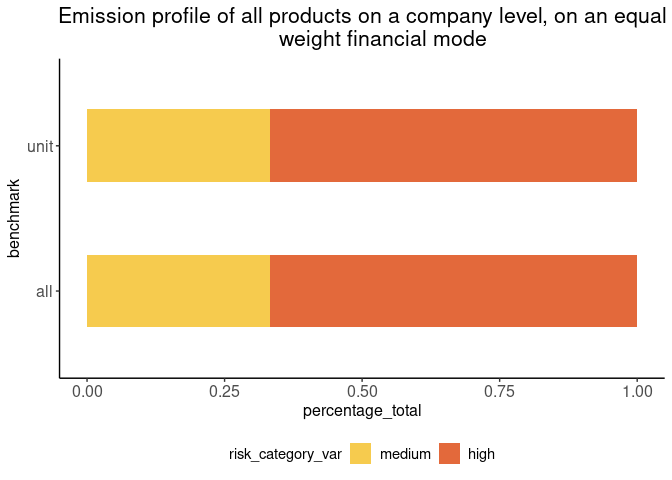
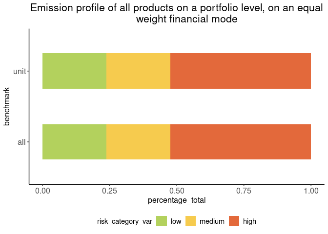

<!-- README.md is generated from README.Rmd. Please edit that file -->

# tiltPlot

<!-- badges: start -->

[](https://lifecycle.r-lib.org/articles/stages.html#experimental)
[](https://github.com/2DegreesInvesting/tiltPlot/actions/workflows/R-CMD-check.yaml)
[](https://app.codecov.io/gh/2DegreesInvesting/tiltPlot?branch=main)
<!-- badges: end -->

The goal of tiltPlot is to provide plots for the TILT project.

``` r
library(ggplot2)
library(tiltPlot)
```

### 1. Sankey Plot with and without financial data

``` r
financial
#> # A tibble: 114 × 13
#>    kg_id  amount_total company_name  wz    amount_of_distinct_products
#>    <chr>         <int> <chr>         <chr>                       <int>
#>  1 bank_a         1000 peter peasant A                               1
#>  2 bank_a         1000 peter peasant A                               1
#>  3 bank_a         1000 peter peasant A                               1
#>  4 bank_a         1000 peter peasant A                               1
#>  5 bank_a         1000 peter peasant A                               1
#>  6 bank_a         1000 peter peasant A                               1
#>  7 bank_a         1000 peter         B                               2
#>  8 bank_a         1000 peter         B                               2
#>  9 bank_a         1000 peter         B                               2
#> 10 bank_a         1000 peter         B                               2
#> # ℹ 104 more rows
#> # ℹ 8 more variables: xctr_risk_category <chr>, benchmark <chr>,
#> #   product_name <chr>, tilt_sector <chr>, equal_weight_finance <dbl>,
#> #   worst_case_finance <int>, best_case_finance <int>, main_activity <int>
```

Here is the default Sankey Plot. By default the function plots with
companies and uses an “equal_weight” mode.

``` r
fin <- financial
plot_sankey_financial(fin)
```


You can also choose to have the plot without the company node.

``` r
plot_sankey_financial(fin, with_company = FALSE)
```


Finally, the user can choose different modes to plot the Sankey plot
with financial data available.

``` r
plot_sankey_financial(fin, with_company = FALSE, mode = "best_case")
```


### 2. XCTR plots without financial data

``` r
xctr_toy_data
#> # A tibble: 6 × 4
#>   company_name xctr_risk_category xctr_share benchmark
#>   <chr>        <chr>                   <dbl> <chr>    
#> 1 company_a    high                      0.5 unit     
#> 2 company_a    low                       0.5 unit     
#> 3 company_a    medium                    0   unit     
#> 4 company_b    high                      0   tilt_sec 
#> 5 company_b    medium                    0   tilt_sec 
#> 6 company_b    low                       1   tilt_sec
```

Plot on a company-level:

``` r
plot_xctr_company(xctr_toy_data, "company_a") +
  # You can customize your plots as usual with ggplot2: https://ggplot2.tidyverse.org/
  labs(title = "Risk distribution of all products for company_a")
```



Plot on a portfolio-level:

``` r
plot_xctr_portfolio(xctr_toy_data) +
  labs(title = "Risk distribution of all products on a portfolio level")
```



### 3. XCTR plots with financial data

``` r
financial
#> # A tibble: 114 × 13
#>    kg_id  amount_total company_name  wz    amount_of_distinct_products
#>    <chr>         <int> <chr>         <chr>                       <int>
#>  1 bank_a         1000 peter peasant A                               1
#>  2 bank_a         1000 peter peasant A                               1
#>  3 bank_a         1000 peter peasant A                               1
#>  4 bank_a         1000 peter peasant A                               1
#>  5 bank_a         1000 peter peasant A                               1
#>  6 bank_a         1000 peter peasant A                               1
#>  7 bank_a         1000 peter         B                               2
#>  8 bank_a         1000 peter         B                               2
#>  9 bank_a         1000 peter         B                               2
#> 10 bank_a         1000 peter         B                               2
#> # ℹ 104 more rows
#> # ℹ 8 more variables: xctr_risk_category <chr>, benchmark <chr>,
#> #   product_name <chr>, tilt_sector <chr>, equal_weight_finance <dbl>,
#> #   worst_case_finance <int>, best_case_finance <int>, main_activity <int>
```

On a company level:

``` r
fin <- financial
plot_xctr_company_financial(fin, "peter", mode = "best_case") +
  labs(title = "Risk distribution of all products on a company level, best case financial weight")
```


On a portfolio level:

``` r
plot_xctr_portfolio_financial(fin, mode = "best_case")+
  labs(title = "Risk distribution of all products on a portfolio level, best case scenario")
```


