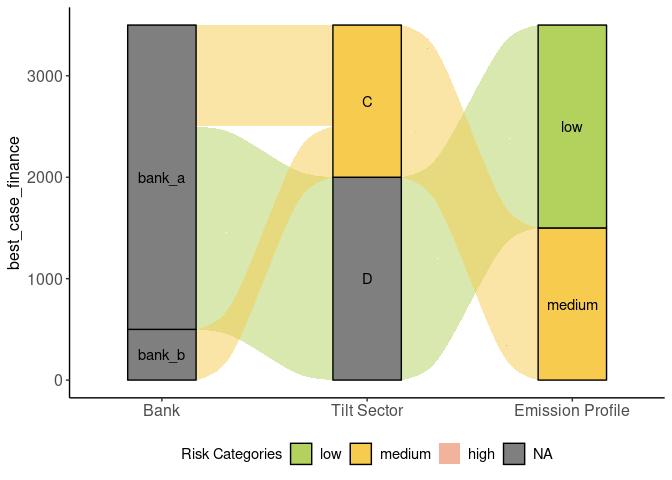

<!-- README.md is generated from README.Rmd. Please edit that file -->

# tiltPlot

<!-- badges: start -->

[](https://lifecycle.r-lib.org/articles/stages.html#experimental)
[](https://github.com/2DegreesInvesting/tiltPlot/actions/workflows/R-CMD-check.yaml)
[](https://app.codecov.io/gh/2DegreesInvesting/tiltPlot?branch=main)
<!-- badges: end -->

The goal of tiltPlot is to provide plots for the TILT project.

## Installation

You can install the development version of tiltPlot from GitHub with:

``` r
# install.packages("pak")
pak::pak("2DegreesInvesting/tiltPlot")
```

## Example

``` r
library(ggplot2)
library(dplyr, warn.conflicts = FALSE)
library(tiltPlot)
```

### 1. Sankey Plot with financial data

``` r
financial
#> # A tibble: 114 × 13
#>    bank_id amount_total company_name postcode wz    xctr_risk_category benchmark
#>    <chr>          <int> <chr>           <int> <chr> <chr>              <chr>    
#>  1 bank_b           500 peter peasa…    53773 A     high               all      
#>  2 bank_b           500 peter peasa…    53773 A     high               unit     
#>  3 bank_b           500 peter peasa…    53773 A     medium             tilt_sec 
#>  4 bank_b           500 peter peasa…    53773 A     medium             unit_til…
#>  5 bank_b           500 peter peasa…    53773 A     low                isic_sec 
#>  6 bank_b           500 peter peasa…    53773 A     medium             unit_isi…
#>  7 bank_b           500 tilman          12043 D     low                all      
#>  8 bank_b           500 tilman          12043 D     low                unit     
#>  9 bank_b           500 tilman          12043 D     medium             tilt_sec 
#> 10 bank_b           500 tilman          12043 D     medium             unit_til…
#> # ℹ 104 more rows
#> # ℹ 6 more variables: product_name <chr>, tilt_sector <chr>,
#> #   amount_of_distinct_products <int>, equal_weight_finance <dbl>,
#> #   worst_case_finance <int>, best_case_finance <int>
```

Here is the default Sankey Plot. By default the function plots with
companies and uses an “equal_weight” mode.

``` r
fin <- financial
plot_sankey(fin)
```


You can also choose to have the plot without the company node.

``` r
plot_sankey(fin, with_company = FALSE)
```


Finally, the user can choose different modes to plot the Sankey plot
with financial data available.

``` r
plot_sankey(fin, with_company = FALSE, mode = "best_case")
```



### 2. XCTR plots with financial data

``` r
financial
#> # A tibble: 114 × 13
#>    bank_id amount_total company_name postcode wz    xctr_risk_category benchmark
#>    <chr>          <int> <chr>           <int> <chr> <chr>              <chr>    
#>  1 bank_b           500 peter peasa…    53773 A     high               all      
#>  2 bank_b           500 peter peasa…    53773 A     high               unit     
#>  3 bank_b           500 peter peasa…    53773 A     medium             tilt_sec 
#>  4 bank_b           500 peter peasa…    53773 A     medium             unit_til…
#>  5 bank_b           500 peter peasa…    53773 A     low                isic_sec 
#>  6 bank_b           500 peter peasa…    53773 A     medium             unit_isi…
#>  7 bank_b           500 tilman          12043 D     low                all      
#>  8 bank_b           500 tilman          12043 D     low                unit     
#>  9 bank_b           500 tilman          12043 D     medium             tilt_sec 
#> 10 bank_b           500 tilman          12043 D     medium             unit_til…
#> # ℹ 104 more rows
#> # ℹ 6 more variables: product_name <chr>, tilt_sector <chr>,
#> #   amount_of_distinct_products <int>, equal_weight_finance <dbl>,
#> #   worst_case_finance <int>, best_case_finance <int>
```

On a company level:

``` r
fin <- financial

plot_xctr_financial(fin, "peter", mode = "worst_case") +
  labs(title = "Risk distribution of all products on a company level, on a financial weight")
```


On a portfolio level:

``` r
plot_xctr_financial(fin, mode = "worst_case") +
  labs(title = "Risk distribution of all products on a portfolio level, on a financial weight")
```


### 3. Emission profile plots without financial data

``` r
without_financial
#> # A tibble: 114 × 6
#>    company_name postcode xctr_risk_category benchmark   product_name tilt_sector
#>    <chr>           <int> <chr>              <chr>       <chr>        <chr>      
#>  1 bruno           27568 high               all         car          D          
#>  2 bruno           27568 high               all         steel        C          
#>  3 bruno           27568 medium             unit        banana       B          
#>  4 bruno           27568 medium             tilt_sec    banana       B          
#>  5 bruno           27568 high               unit_tilt_… banana       B          
#>  6 bruno           27568 medium             isic_sec    banana       B          
#>  7 bruno           27568 high               unit_isic_… banana       B          
#>  8 bruno           27568 medium             unit        car          D          
#>  9 bruno           27568 high               tilt_sec    car          D          
#> 10 bruno           27568 medium             unit_tilt_… car          D          
#> # ℹ 104 more rows
```

Plot on a company level. The user can choose any number of benchmark to
be plotted. If the benchmarks argument is not given to the function, the
function will plot all the benchmarks.

``` r
no_fin <- without_financial

benchmarks <- c("all", "unit", "isic_sec")

no_fin |>
  filter(company_name == "peter") |>
  bar_plot_emission_profile(benchmarks) +
  labs(title = "Emission profile of all products on a company level")
```


Plot on a portfolio level.

``` r
bar_plot_emission_profile(no_fin, benchmarks) +
  labs(title = "Emission profile of all products on a portfolio level")
```


### 4. Create a German map with risk categories color gradient, without financial

Different modes can be chosen: “equal_weight”, “worst_case” and
“best_case”. If nothing is chosen, equal_weight the default mode.

``` r
no_fin <- without_financial

map_region_risk(no_fin, "DE", benchmark = "tilt_sec", mode = "worst_case") +
  labs(title = "German map of high, medium and low proportions of the companies
  that are found in one region.
  © EuroGeographics for the administrative boundaries ")
#> Extracting data using giscoR package, please report issues on https://github.com/rOpenGov/giscoR/issues
```


### 5. Create a German map with risk categories color gradient, with financial

``` r
map_region_risk_financial(financial, "DE", benchmark = "unit_isic_sec") +
  labs(title = "German map of high, medium and low propotion of the companies
  that are found in one region.
  © EuroGeographics for the administrative boundaries ")
#> 'make_valid' argument has been deprecated
#> Extracting data using giscoR package, please report issues on https://github.com/rOpenGov/giscoR/issues
```


